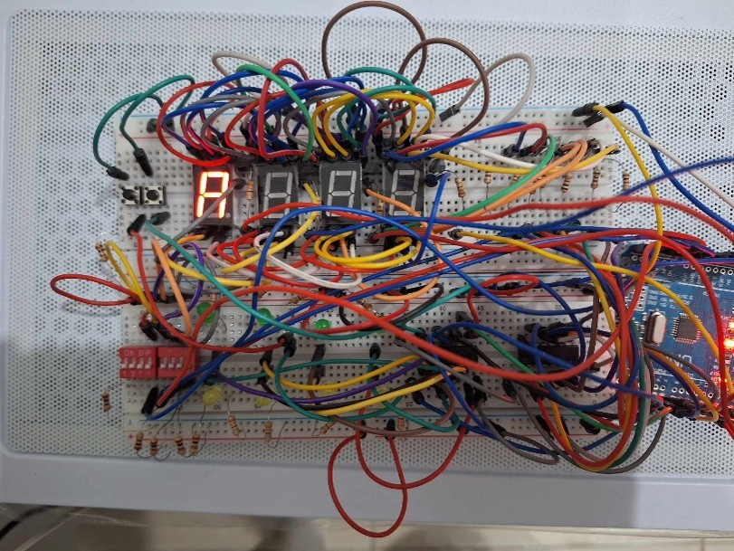
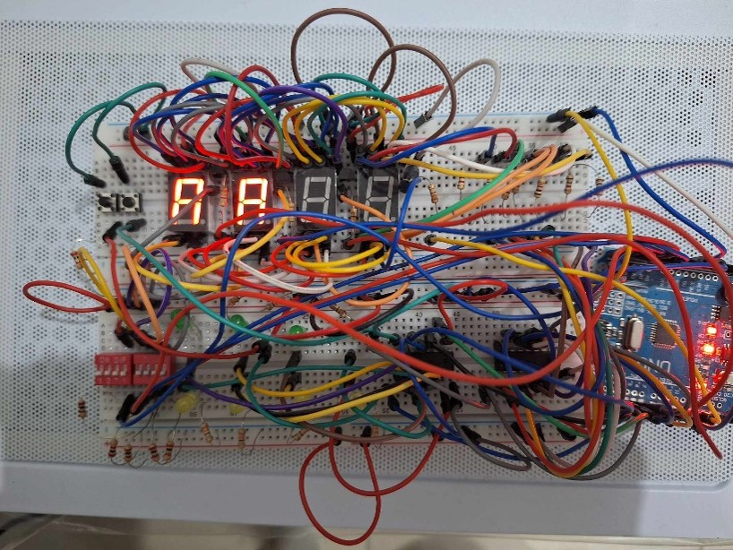
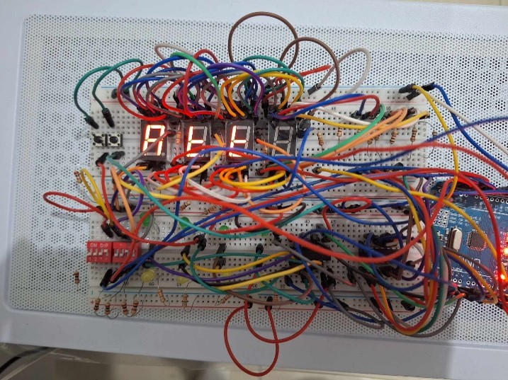
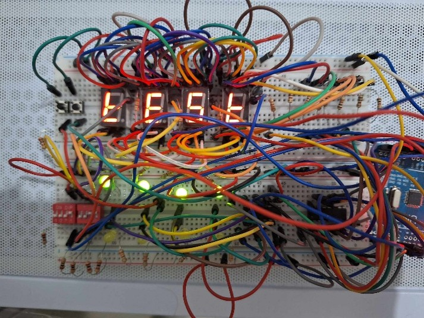

# atmega328p-assembly-wordle
A Wordle game developed on Arduino (ATmega328P) using AVR Assembly for direct hardware register manipulation, featuring 7-segment multiplexing and hardware interrupts.

## System Features & Core Mechanics

This project features a hardware-based, standalone word-guessing game inspired by "Wordle," tailored for a 4-character hidden word design.

### Game Rules & Feedback Logic
* **Green LED:** Activates when the selected character matches the hidden solution in both identity and exact position.
* **Yellow LED:** Activates when the selected character exists within the hidden solution but is currently placed in a wrong position.
* **LED Off:** No status lights will turn on if the guessed character is entirely absent from the solution.
* *Note: Green and Yellow LEDs for the same digit will never illuminate concurrently.*

### Alphanumeric Input Mechanism
Players select characters dynamically via a 5-bit DIP switch array mapped to binary index values ($a\text{--}z$):
* Letter **'A'** (1st Alphabet) $\rightarrow$ Registered via binary `00000`
* Letter **'Z'** (26th Alphabet) $\rightarrow$ Registered via binary `11001`
* The raw binary state from the DIP switches is continuously cross-referenced with a Program Memory `lookup_table` to decode and display the character on the active 7-segment display digit.

---

## Hardware Subsystems & I/O Architecture

### 1. 4-Digit 7-Segment Display Subsystem
* **Multiplexed Driving Logic:** Features a 4-digit common-cathode 7-segment grid driven by BC547 NPN transistors to handle high-side digit selection. Each digit displays the real-time input from the DIP switches during the editing phase.
* **Serial-In Parallel-Out (SIPO) Bus:** Controlled using a 3-pin macro pipeline connected to a 74HC595 shift register:
    * `DS` (Data Serial): Transfers the 8-bit segment pattern serially.
    * `SHCP` (Shift Register Clock Pulse): Synchronizes the bit-shifting cadence.
    * `STCP` (Storage Register Clock Pulse / Latch): Latches data on a rising edge to push the parallel data out to the display segments.

### 2. LED Validation Grid Subsystem
* **Matrix Configuration:** Utilizes 8 discrete LEDs (4 Green, 4 Yellow) grouped per display digit. 
* **Dual-Nibble Data Packing:** Driven by a dedicated 74HC595 shift register using an efficient 3-pin control interface. The 8-bit output data frame is structurally split into two 4-bit nibbles:
    * **Upper 4 Bits (MSB Nibble):** Map the activation flags for the Green LEDs.
    * **Lower 4 Bits (LSB Nibble):** Map the activation flags for the Yellow LEDs.

### 3. Asynchronous External Interrupt Routines
* **`INT0` (Digit Select Button):** Generates an edge-triggered interrupt to latch the current 5-bit DIP switch values into the runtime register for that specific digit position, then automatically increments the cursor to the next digit. It wraps around back to the first digit after reaching the 4th position.
* **`INT1` (Word Submission Button):** Generates an edge-triggered interrupt to process array-matching validation logic. It updates the feedback LED registers immediately. If all 4 digits match perfectly (all Green LEDs active), the game state advances, loading the next hidden word from the internal storage dictionary.

## Hardware Demonstration & Step-by-Step Gameplay

Below is a step-by-step walkthrough of the physical system operation during a live gameplay session, where the hidden solution word is **"TEST"**.

### Phase 1: Game Initialization & Character Input
1. **System Startup:** When powered on, the 4-digit 7-segment display and status LEDs initialize to their default states.
   

2. **Entering the 1st Character ('A'):** The player configures the 5-bit DIP switch to `00000` (representing 'A'). Pressing the **`INT0` button** registers the letter 'A' into the first digit position.
   

3. **Entering the 2nd Character ('T'):** The player rotates the DIP switch to configuration `10011` (representing 'T') and presses the **`INT0` button** to register 'T' into the second digit position.
   
   
4. **Entering the Remaining Characters:** The player rotates the DIP switches to input characters for the next slots, pressing **`INT0`** to advance the cursor until all 4 positions are filled.
   

### Phase 2: Word Validation & Feedback Logic
5. **Submitting the Guess:** The player presses the **`INT1` button** to execute the validation routine. The system evaluates the input against the hidden word **"TEST"**:
   * If a character is partially correct (exists in the word but wrong spot), a **Yellow LED** lights up.
   * If a character is completely correct and in the right spot, a **Green LED** lights up.
   

6. **Winning Condition (Puzzle Solved):** Once the player correctly guesses all characters in their exact positions (**"T", "E", "S", "T"**), all **4 Green LEDs** illuminate simultaneously. The system automatically shifts and loads the next hidden vocabulary word (e.g., **"PLAY"**) from Flash memory to start a new game.
   
